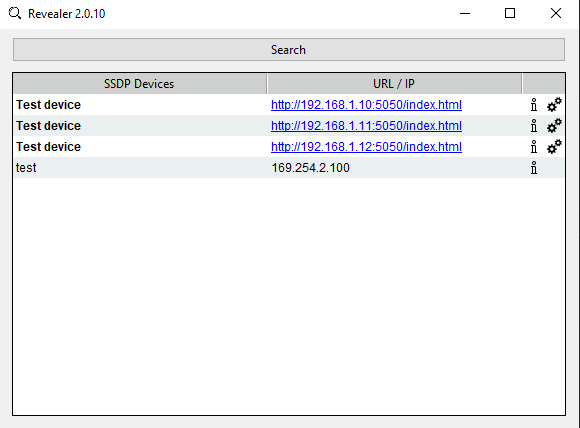

# revealer

Программа для поиска сетевых устройств в локальной сети по SSDP / UPnP.

## Поддержка

Windows, Linux, macOS.

## Запуск и использование

1. Выберете приложение для вашей операционной системы и запустите его.
2. Нажмите кнопку `Search`, чтобы получить / обновить список найденных сетевых устройств, поддерживающих SSDP.

    
3. В полученном списке доступные устройства, находящиеся в той же локальной сети, что и Ваш компьютер, будут иметь в графе `URL / IP` выделенную кликабельную ссылку (синего цвета с подчеркиванием). Эти страницы могут быть открыты кликом левой кнопкой мыши по соответствующей ячейке столбца `URL / IP`.

    
4. Справа от ссылок в соответствующей строке будет иконка информации об устройстве () - при нажатии на неё можно открыть список свойств данного устройства.

    
5. Для недоступных для Вашего компьютера устройств (в другой подсети) в графе `URL / IP` будет указан только их IP-адрес в другой сети и список информации об устройстве будет короче, поскольку `revealer` не может получить полное описание устройства с помощью HTTP-запроса по ссылке `Location`.

    
6. Для устройств, которые поддерживают это расширение протокола, доступна опция изменения IP-адреса с использованием расширенного SSDP. Для этого:
    * С помощью нажатия на иконку с двумя шестеренками () откройте окно `Change settings...`. Если данная опция недоступна, значит, версия устройства её не поддерживает.
    
        
    * в открывшимся окне введите пароль устройства, выберете или уберите галочку с DHCP (динамический способ получения сетевых настроек от DHCP-сервера в сети), укажите желаемый IP-адрес, маску подсети и при необходимости шлюз по умолчанию.
    * нажмите `Ок`.
    * через некоторое время появится окно с результатом выполнения установки настроек: если пароль и настройки были приняты устройством для применения, то результат будет `Success` - если же что-то пошло не так, то появится окно `Error`.
    * в случае успешной отправки настроек обновите список устройств кнопкой `Search`, чтобы найти данное устройство с новым адресом.
    
## Сборка

Пожалуйста, воспользуйтесь [инструкцией по сборке](/BUILD.md), чтобы собрать `revelear` из исходного кода для вашей операционной системы.
    
## Замечания

* Сервер с поддержкой изменения настроек по расширенному SSDP можно найти в репозитории https://github.com/EPC-MSU/pyssdp_server .

* Найденные устройства сортируются сначала по принципу "поддерживающие изменение настроек через расширенный SSDP - выше; неподдерживающие - ниже", а затем в каждой из двух этих групп идет сортировка устройств по алфавиту.

* Обратите внимание, что для поиска устройств в другой сети может потребоваться отключение брандмауэра, о чем ваш ПК может попросить при первом старте `revealer`. В ином случае может потребоваться ручное отключение брандауэра.

* Для корректной работы программы `revealer` на виртуальной машине нужно указать в её настройках тип подключения "Сетевой мост" (Сеть->Адаптер 1->Тип подключения).
